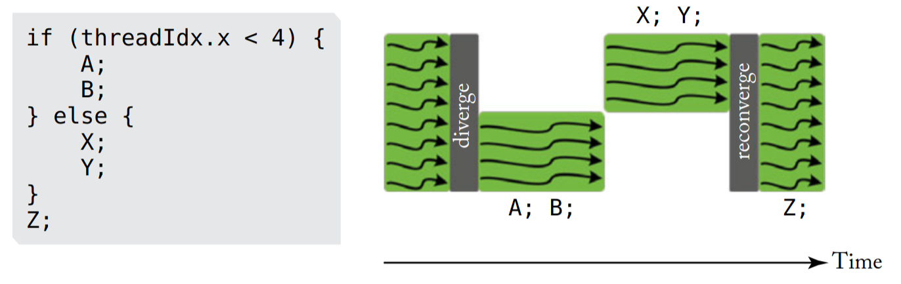

# Smol GPU
[]()
[]()
[]()
[]()

An educational implementation of a parallel processor in system-verilog.

The [Intro to GPU Architecture](#intro-to-gpu-architecture) chapter is a short write-up on the theoretical basics needed to understand the GPU implemented in this repository.

If you want to set up the simulation on your machine, see [Simulation](#simulation) and [Project Structure](#project-structure).

- [Introduction](#introduction)
- [Intro to GPU Architecture](#intro-to-gpu-architecture)
  - [Comparison with CPUs](#comparison-with-cpus)
  - [SIMT Architecture](#simt-architecture)
  - [Branching](#branching)
- [ISA](#isa)
  - [Vector Registers](#vector-registers)
  - [Scalar Registers](#scalar-registers)
  - [Instructions](#instructions)
    - [Instruction List](#instruction-list)
- [Assembly](#assembly)
  - [Syntax](#syntax)
  - [Example](#example)
- [Microarchitecture](#microarchitecture)
- [Project Structure](#project-structure)
- [Simulation](#simulation)
  - [Justfile](#justfile)
  - [CMake](#cmake)
  - [Running the Simulator](#running-the-simulator)
- [Acknowledgments](#acknowledgments)
- [Roadmap](#roadmap)

## Introduction

The purpose of this project was to create an open-source GPU which can serve as an introduction to modern GPU architecture.
The project is heavily influenced [tiny-gpu](https://github.com/adam-maj/tiny-gpu).
It builds upon tiny-gpu by incorporating a more advanced ISA (based on RISC-V RV32I), having multiple warps per each core and supporting branching, among other things.

For someone trying to learn how a GPU works, I still recommend checking out tiny-gpu first, and only then coming back to this project.

The rest of this chapter is an introduction to GPU architecture.

## Intro to GPU Architecture
Nowadays, graphics cards are designed with the purpose of processing large amounts of data in a parallel manner.
The massive parallelism seen in GPUs stems from their initial purpose - processing data for each pixel on the screen.

In the early 2000s, programmers realised that this computational model can be used for more than just graphics programming.
Thus, we got cards like NVIDIA Geforce series 3, GeForce 4 or ATI Radeon 8500, which were first to introduce programmable shaders.

Later on, that evolved into frameworks like CUDA, and so currently graphics cards are widely used for parallel computation in fields such as machine learning, cryptography or scientific computing.

### Comparison with CPUs
Most modern CPUs are designed to be versatile in their function.
They have to perform both sequential and parallel computations while also running the operating system and handling I/O operations.

In contrast to that, GPUs are designed with a single goal in mind - processing as much data in parallel as possible.
The currently used paradigm that helps achieve that is called **SIMT (Single Instruction Multiple Thread)**, which is described in the next subchapter.

### SIMT architecture
We have two goals when designing a GPU.
The first is to be able to process as much data in parallel as possible.
The second goal is to avoid breaking the fully parallel programming model.
What that means, is that from the perspective of a programmer, we want to create an illusion of all the computation happening in parallel.

For example, when someone runs this sort of CUDA code:
```cpp
vector_add <<< 256 , 1024 >>> (d_out, d_a, d_b, N);
```
What they expect, is that there will be 256 blocks of 1024 threads running in parallel.

However, in practice, we are limited by the hardware - we can't actually have an arbitrary number of independent cores running the computation.

In that case, what is the best way to create a chip that is both efficient in parallel computation and possible to implement using actual hardware?
The answer is **Multi-threaded** architecture.

Our GPU will have multiple **cores** (known as SMs in Nvidia's terminology), which are independent processors.
Each of those cores has many **threads** which are grouped into **warps**.

Threads within a single warp execute the same instruction but with different data and state.
Each of them has it's own set of registers, which are called **vector registers**.

As previously mentioned, all the threads within a warp execute the same instruction in lockstep.
That means that every warp has a separate program counter which is shared between the threads.
The warps also have their own set of registers, which are called **scalar registers**.

So, why do we organize our GPU in such a way?
We are taking advantage of the characteristics of modern processors - some operations take more time than others.
As an example, memory access can be a few orders of magnitude slower than a simple add instruction and in most cases, fetching from memory is what a processor spends most of it's time doing.
Reducing or masking the latency caused by memory is a good way to make our processor faster.

The number of threads is much greater than the number of units such as ALU (Arithmetic Logic Unit) or LSU (Load Store Unit).
At each point in time, only one of the warps has access to the resources of the core while others do some work in the background, like fetching an instruction or data from memory.

With that architecture, we can relatively cheaply increase the number of threads within a core, because the number of warps is independent of the number of resources (ALUs, LSUs).

One obvious issue is a situation in which threads within a single warp take divergent paths within the code (one chooses `if` and another `else`).

### Branching
There are a couple ways to solve this problem.
The one I will describe here and that I implemented inside this GPU uses masking.

As previously mentioned, each of the warps is given a set of registers.
One of those registers is called **the execution mask**.
Each of it's bits corresponds to one of the threads within that warp and denotes whether this particular thread should execute the next instruction (1 -> execute, 0 -> noop).

In addition to that, we need an instruction which will set those bits based on certain conditions.
For example, RISC-V has a `slti, rd, rs1, imm` instruction, which compares a `rs` register to an immediate value and outputs a single bit to the `rd` register - `1` if it's true and `0` otherwise.

Now, let's modify this instruction in such a way, that each of the threads within the warp modifies a single bit in one of the warp's registers.
Then we can run comparisons on each of the threads within a warp independently and mask the execution of next instructions based on the outcome.

What a compiler developer might do, is generate code that executes both paths of the `if` statement.
For the first path we use the execution mask produced by the compare function.
For the second path we invert the mask and execute it as well.

If we run into nested ifs, we can create a software stack which will keep the previous mask.

An example is shown in the picture below:

*Image taken from General-Purpose Graphics Processor Architecture (2018).*

## ISA
The GPU itself, is based on a 32-bit word, 32-bit address space ISA that closely resembles RV32I.
Some of the instructions that don't apply to a GPU design have been cut out (fence, csrrw, etc).
Also, currently, there is also no support for unsigned arithmetic instructions.

In order to differentiate between the warp and thread registers or instructions, the first ones will be called **scalar** and the second ones will be called **vector**.

### Vector Registers
Each of the threads within a warp has 32 of 32-bit registers.
As mentioned above, those are called vector registers and will be denoted with an `x` prefix (`x0`-`x31`).

Just like RV32I, `x0` is a read-only register with value 0.
However, for the purposes of GPU programming, registers `x1` - `x3` are also read-only and have a special purpose.
Namely, they contain the thread id, block id and block size, in that order.

The rest of the registers (`x4` - `x31`) are general purpose.

|**Register**|**Function**   |
|------------|---------------|
|`x0`        |zero           |
|`x1`        |thread id      |
|`x2`        |block id       |
|`x3`        |block size     |
|`x4`-`x31`  |general purpose|

### Scalar registers
Similarly to their vector counter part, there are 32 scalar registers that hold 32-bit words.
In order to differentiate between them, the scalar registers are prefixed with `s` (`s0`-`s31`).
The zero-th register is also tied to 0.

Register `s1` is called the execution mask and has a special purpose but is not read-only.
As mentioned in the intro, each of the bits in that register denotes whether the corresponding thread should execute the current instruction.

This is also the reason why the GPU can be configured to have at most 32 threads per warp (size of the register).


|**Register**|**Function**   |
|------------|---------------|
|`s0`        |zero           |
|`s1`        |execution mask |
|`s2`-`x31`  |general purpose|

### Instructions
The instructions are split into three types:
- vector instructions
- scalar instructions
- vector-scalar instructions

Vector instructions are executed by each thread on the vector registers, scalar instructions by each warp on the scalar registers and the vector-scalar instructions are a mix (more on that later).

Which instruction is being executed is determined by three values:
- opcode,
- funct3,
- funct7

All of the vector instructions have their scalar equivalent but not vice versa.
Specifically, the jump and branch instructions are scalar-only, because only the warps have a program counter (`jal`, `jalr`, `beq`, `bne`, `blt`, `bge`).

The most significant bit of the opcode is always equal to 0 for vector instruction and to 1 for other types.
That means, that changing the instruction type from vector to scalar is equivalent to this operation `(opcode) & (1 << 6)`.

#### Instruction list
Below is the instruction list.
The `S` bit in opcode denotes whether the instruction is vector or scalar with (1 - scalar, 0 - vector).
| mnemonic | opcode  | funct3 | funct7    |
|----------|---------|--------|-----------|
| **U-type**    |        |          |     |
| lui      | S110111 |   —    |     —     |
| auipc    | S010111 |   —    |     —     |
| **I-type arithmetic**  |          |     |
| addi     | S010011 | 000    |     —     |
| slti     | S010011 | 010    |     —     |
| xori     | S010011 | 100    |     —     |
| ori      | S010011 | 110    |     —     |
| andi     | S010011 | 111    |     —     |
| slli     | S010011 | 001    | 0000000X  |
| srli     | S010011 | 101    | 0000000X  |
| srai     | S010011 | 101    | 0100000X  |
| **R-type**    |        |          |     |
| add      | S110011 | 000    | 00000000  |
| sub      | S110011 | 000    | 01000000  |
| sll      | S110011 | 001    | 00000000  |
| slt      | S110011 | 010    | 00000000  |
| xor      | S110011 | 100    | 00000000  |
| srl      | S110011 | 101    | 00000000  |
| sra      | S110011 | 101    | 01000000  |
| or       | S110011 | 110    | 00000000  |
| and      | S110011 | 111    | 00000000  |
| **Load**      |        |          |     |
| lb       | S000011 | 000    |     —     |
| lh       | S000011 | 001    |     —     |
| lw       | S000011 | 010    |     —     |
| **Store**     |        |          |     |
| sb       | S100011 | 000    |     —     |
| sh       | S100011 | 001    |     —     |
| sw       | S100011 | 010    |     —     |
| **J-type**    |        |          |     |
| jal      | 1110111 |  —     |     —     |
| **I-type jumps** |     |          |     |
| jalr     | 1110011 | 000    |     —     |
| **B-type**    |        |          |     |
| beq      | 1110011 | 000    |     —     |
| bne      | 1110011 | 001    |     —     |
| blt      | 1110011 | 100    |     —     |
| bge      | 1110011 | 101    |     —     |
| **HALT**      |        |          |     |
| halt     | 1111111 |   —    |     —     |
| **SX type**   |        |          |     |
| sx.slt   | 1111110 |   —    |     —     |
| sx.slti  | 1111101 |   —    |     —     |

## Assembly
Currently, the supported assembly is quite simple.
It takes a single input file and line by line compiles it into machine code.

There are two directives supported:
- `.blocks <num_blocks>` - denotes the number of blocks to dispatch to the GPU,
- `.warps <num_blocks>` - denotes the number of warps to execute per each block

Together they form an API similar to that of CUDA:
```cuda
kernel<<<numBlocks, threadsPerBlock>>>(args...)`
```
The key difference being that CUDA allows you to set the number of threads per block while this GPU accepts the number of warps per block as a kernel parameter. 
A compiler developer can still implement the CUDA API using execution masking.

### Syntax
The general syntax looks as follows:
```
<mnemonic> <rd>, <rs1>, <rs2>       ; For R-type
<mnemonic> <rd>, <rs1>, <imm>       ; For I-type
<mnemonic> <rd>, <imm>              ; For U-type
<mnemonic> <rd>, <imm>(<rs1>)       ; For Load/Store
HALT                                ; For HALT
jalr <rd>, <label>                  ; jump to label
jalr <rd>, <imm>(<rs1>)             ; jump to register + offset
```
In order to turn the instruction from vector to scalar you can add the `s.` prefix.
So if you want to execute the scalar version of `addi` you would put `s.addi` as the mnemonic and use scalar registers as `src` and `dest`.

Each of the operands must be separated by a comma.

The comments are single line and the comment char is `#`.

#### Example
An example program might look like this:
```python
.blocks 32
.warps 12

# This is a comment
jalr x0, label              # jump to label
label: addi x5, x1, 1       # x5 := thread_id + 1
sx.slti s1, x5, 5           # s1[thread_id] := x5 < 5 (mask)
sw x5, 0(x1)                # mem[thread_id] := x5 (only non-masked threads exectute this)
halt                        # Stop the execution
```

## Microarchitecture
todo

## Project structure
The project is split into several subdirectories:
- `external` - contains external dependencies (e.g. doctest)
- `src` - contains the system-verilog implementation of the GPU
- `sim` - contains the verilator based simulation environment and the assembler
- `test` - contains test files for the GPU, the assembler and the simulator

## Simulation
The prerequistes for running the simulation are:
- [verilator](https://www.veripool.org/wiki/verilator)
- [cmake](https://cmake.org/)
- A C++ compiler that supports C++23 (e.g. g++-14)

Verilator is a tool that can simulate or compile system-verilog code.
In this project, verilator translates the system-verilog code into C++ which then gets included as a library in the simulator.
Once the prerequistes are installed, you can build and run the simulator executable or the tests.
There are currently two ways to do this:

### Justfile
First, and the more convenient way, is to use the provided [justfile](https://github.com/casey/just).
`Just` is a modern alternative to `make`, which makes it slightly more sane to write build scripts with.
In the case of this project, the justfile is a very thin wrapper around cmake.
The available recipes are as follows:
- `compile` - builds the verilated GPU and the simulator
- `run <input_file.as> [data_file.bin]` - builds and then runs the simulator with the given assembly file
- `test` - runs the tests for the GPU, the assembler and the simulator
- `clean` - removes the build directory

In order to use it, just type `just <recipe>` in one of the subdirectories.

**Note, that the paths you pass as arguments to the `run` recipe are relative to the root of the project.
This is due to the way that the `just` command runner works.**

### CMake
As mentioned, the justfile is only a wrapper around cmake.
In case you want to use it directly, follow these steps:
```bash
mkdir build
cd build
cmake ..
cmake --build . -j$(nproc)
# The executable is build/sim/simulator
# You can also run the tests with the ctest command when in the build directory
```

### Running the simulator
The produced exectuable is located at `build/sim/simulator` (or you can just use the justfile).
You can run it in the following way:
```bash
./build/sim/simulator <input_file.as> <data_file.bin>
```
The simulator will first assemble the input file and load the binary data file into the GPU data memory.
The program will fail if the assembly code contained in the input file is ill-formed.

In case it manages to assemble the code, it will then run the simulation and print the first 100 words of the memory to the console.
This is a temporary solution and will be replaced by a more sophisticated output mechanism in the future.

## Acknowledgments
Special thanks go to Adam Majmudar, the creator of [tiny-gpu](https://github.com/adam-maj/tiny-gpu).
As previously mentioned, this project is heavily inspired by it and built on top of it.

The architecture itself is a modified variant of [RISC-V](https://github.com/riscv) RV32I.

Much of the knowledge I've gathered in order to create this project comes from the General-Purpose Graphics Processor Architecture book(2018) by Tor M. Aamodt, Wilson Wai Lun Fung and Timothy G. Rogers,
which I highly recommend for anyone interested in the topic.

## Roadmap
There is still a lot of work to be done around the GPU itself, the simulator and the tooling around it.

- [ ] Add more tests and verify everything works as expected
- [ ] Benchmark (add memory latency benchmarks, etc)
- [ ] Parallelize the GPU pipeline
- [ ] Simulate on GEM5 with Ramulator
- [ ] Run it on an FPGA board

Another step would be to implement a CUDA-like compiler as writing the assembly gets very tedious, especially with manually masking out the threads for branching.
